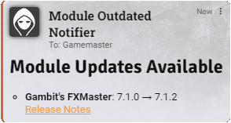
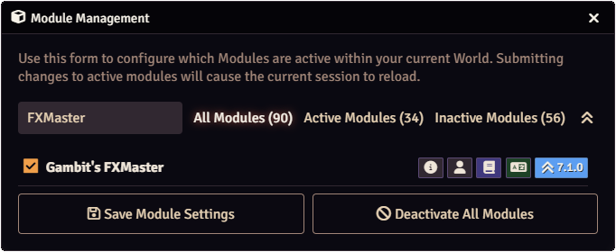

# Module Outdated Notifier (M.O.N.)

A Foundry VTT module that automatically checks for module updates after loading a world and notifies Game Masters when updates are available.

**NOTE:** This module does not work unless a valid API Key is provided. Consult the [Setup section](https://github.com/henry-malinowski/module-outdated-notifier?tab=readme-ov-file#setup). If you're running Foundry in a hosted environment (where you can't access the application files), you will need to source the key by downloading Foundry from the website and using its file to source a valid key. 

## Features

- **Automatic Update Checking**: Checks for module updates when you load a world
- **GM Notifications**: Sends chat messages to Game Masters when updates are available
- **Visual Indicators**: Highlights modules with available updates in the Module Management window
- **Up-to-Date Confirmation**: Notifies you when all enabled modules are current
- **Release Notes Links**: Direct links to release notes for each available update

## Screenshots

### Chat Notification
When updates are available, GMs receive a chat message listing all modules with updates.

  

### Module Management Badge
Modules with available updates are highlighted in the Module Management window with a special badge. Clicking the badge will show the version available and a link to the Release Notes if available.

  

## Installation

### Method 1: Install from Foundry VTT

1. Open Foundry VTT and navigate to the **Add-on Modules** tab
2. Click **Install Module**
3. In the **Manifest URL** field, paste: `https://github.com/henry-malinowski/module-outdated-notifier/releases/latest/download/module.json`
4. Click **Install** and wait for installation to complete
5. Enable the module in your world's **Manage Modules** settings

### Method 2: Manual Installation

1. Download the latest release from the [Releases page](https://github.com/henry-malinowski/module-outdated-notifier/releases)
2. Extract the ZIP file to your Foundry VTT `Data/modules/` directory
3. The module folder should be named `module-outdated-notifier`
4. Enable the module in your world's **Manage Modules** settings

## Setup

### Getting An API Key

The Module Outdated Notifier requires a Foundry VTT API Key to check for module updates. This key can be found in your Foundry VTT installation.

#### Step 1: Locate Your Foundry VTT Application Data

1. Right-click on the Foundry VTT application icon (in your system tray or taskbar).
2. Click **"Browse Application Data"**. (This opens your Foundry VTT application installation).

#### Step 2: Find the License File

1. Navigate to the `dist/core/` folder within your Foundry VTT data directory.
2. Locate the file named `license.mjs`.
3. Open this file in a text editor.

#### Step 3: The Easy Way
1. Drag and Drop that file into this Module's setting for setting the API Key used for checking updates.

#### Step 3: Extract the API Key (Hard Way)
0. Do the previous steps to find `license.mjs`
1. Find where the file contains: `static LICENSE_API_KEY="..."`. This is tricky because the file is all on 1 line.
2. Copy the value between (but not including) the quotes.
3. The API Key will be a mix of numbers and lowercase letters.
4. Copy that into the API Key text box and save.

## Usage

Once configured, the module will automatically:

1. Check for updates when you load a world (after a 7.5 second delay). You'll get a Notification is all active modules are up to data. If not, the following 2 things will happen.
2. Chat message of which active modules have updates available and a link to release notes if available.
3. The Module Management window have light blue update available badges. The hover-over will include the version that is most up to date.

## Support

* **Issues**: Report bugs or request features on the [GitHub Issues](https://github.com/henry-malinowski/module-outdated-notifier/issues) page.
